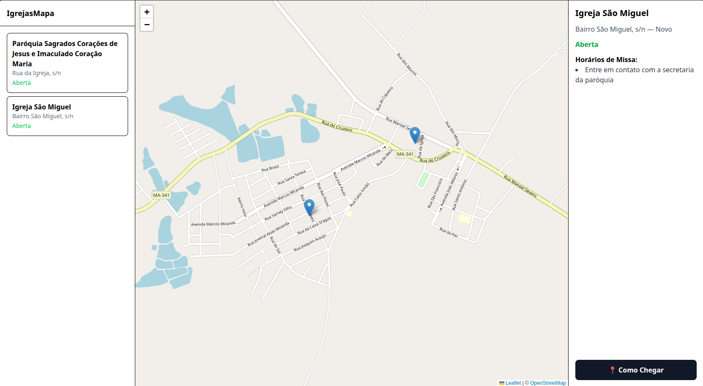

# † IgrejasMapa

Mapa interativo para localização de igrejas católicas na cidade de Bom Lugar. O projeto exibe as igrejas em um mapa, com lista lateral e painel de detalhes com horários de missa e confissão.

> Projeto desenvolvido para portfólio pessoal, com foco em boas práticas de código, organização e documentação.

🔗 **[Ver projeto ao vivo](https://igrejas-mapa.vercel.app)**



---

## Tecnologias

- [React 19](https://react.dev/) — biblioteca para construção de interfaces
- [TypeScript](https://www.typescriptlang.org/) — tipagem estática
- [Vite](https://vite.dev/) — bundler e servidor de desenvolvimento
- [Leaflet](https://leafletjs.com/) + [React-Leaflet](https://react-leaflet.js.org/) — mapas interativos com OpenStreetMap
- [Tailwind CSS v4](https://tailwindcss.com/) — estilização utilitária
- [Prettier](https://prettier.io/) — formatação de código

---

## Funcionalidades

- [x] Mapa interativo com pins de localização
- [x] Lista lateral com nome, endereço e status (aberta/fechada)
- [x] Painel de detalhes com horários de missa e confissão
- [ ] Filtro por bairro
- [ ] Busca por nome
- [ ] Geolocalização do usuário

---

## Como rodar localmente

**Pré-requisitos:** Node.js 18+

```bash
# Clone o repositório
git clone https://github.com/gabrielslsz/IgrejasMapa.git

# Entre na pasta
cd IgrejasMapa

# Instale as dependências
npm install

# Rode o servidor de desenvolvimento
npm run dev
```

Acesse `http://localhost:5173` no navegador.

---

## Estrutura de pastas

```
src/
├── components/
│   ├── ChurchDetail/     # Painel de detalhes da igreja selecionada
│   ├── ChurchList/       # Lista lateral de igrejas
│   └── Maps/             # Componente do mapa com Leaflet
├── data/
│   └── churches.ts       # Dados mockados das igrejas (MVP)
├── types/
│   └── church.ts         # Interface TypeScript Church
├── App.tsx               # Componente raiz e layout principal
└── main.tsx              # Ponto de entrada da aplicação
```

---

## Decisões técnicas

- **Dados em arquivo `.ts`** em vez de banco de dados — suficiente para o MVP e permite tipar os dados com a interface `Church`
- **OpenStreetMap** via Leaflet — gratuito, sem necessidade de API key
- **Tailwind CSS v4** — integrado via plugin do Vite, sem arquivo de configuração separado

---

## Próximos passos

- Migrar dados para o **Supabase** com extensão PostGIS
- Adicionar filtro por bairro e busca por nome
- Exibir distância até a igreja com base na geolocalização do usuário
- Deploy na Vercel

---

## Autor

**Gabriel Sousa**
[GitHub](https://github.com/gabrielslsz)
